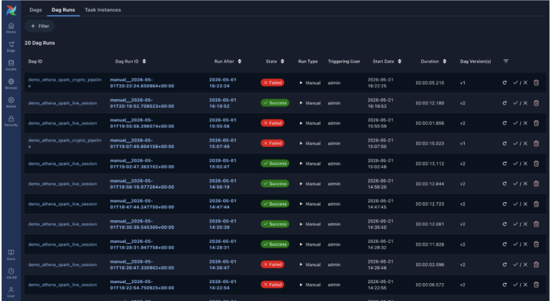
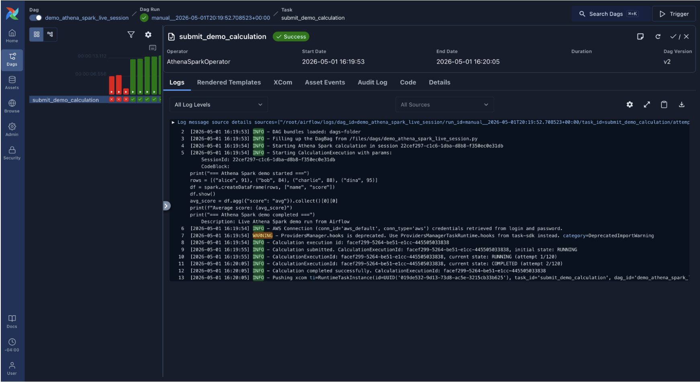
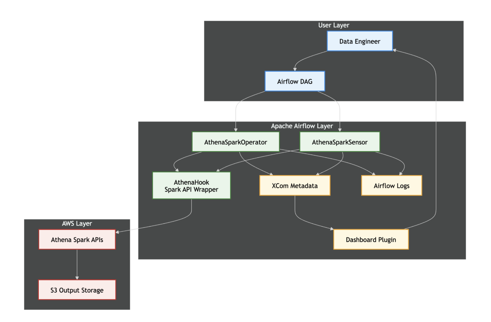

# Native Support for AthenaSparkOperator in Apache Airflow
<picture width="500">
  
</picture>

**Project:** Support for AthenaSparkOperator inside Apache Airflow natively  
**Client:** Apache Airflow Community and TA, Junkai Huang  
**Team Members:** Danish Safdariyan, Andisha Safdariyan, Jack Zhou  
**Demo Video:** [https://youtu.be/L4dKWVUXO5U](https://www.youtube.com/watch?v=DOLWuQM1YrE)

## Table of Contents
1. [Project Overview](#project-overview)
2. [User's Manual](#users-manual)
3. [Maintainer's Manual](#maintainers-manual)
4. [License Agreement](#license-agreement)

---

## Project Overview

This project extends Apache Airflow by introducing native support for AWS Athena Spark calculation APIs. It provides a complete end-to-end workflow for submitting, monitoring, and visualizing Athena Spark jobs directly within the Airflow ecosystem. 

**Key Features:**
* **AthenaSparkOperator:** For submitting Spark jobs and optionally polling for completion.
* **AthenaSparkSensor:** For monitoring the status of existing calculation runs.
* **Athena Spark Dashboard:** A custom Airflow UI plugin featuring a runs list and detailed run views, backed by real XCom metadata.

---

## User's Manual

This section details how Airflow users (Data Engineers, DAG Authors, and Operators) can interact with the new Athena Spark capabilities.

### 1. Submitting a Spark Job
To submit an Athena Spark job within a DAG, use the `AthenaSparkOperator`. 

**Basic Usage:**
You will need to provide the required Spark calculation configuration (such as the workgroup, code block, and execution role) and establish your AWS connection. Once triggered, the operator will submit the job to AWS Athena. If configured to wait, it will poll until the job reaches a terminal state.

### 2. Monitoring an Existing Job
If you have an asynchronous workflow where a job is submitted and monitored in a separate task, use the `AthenaSparkSensor`. Pass the `calculation_execution_id` to the sensor, and it will periodically check AWS until the run succeeds or fails.

### 3. Using the Athena Spark Dashboard
We have built a native Airflow UI plugin to monitor your Spark calculations without leaving Airflow!

* **Accessing the Dashboard:** Navigate to the new Athena Spark tab in the top navigation bar of the Airflow UI.
* **Runs Table:** This page displays all discovered runs. It includes summary widgets and status badges next to your DAG IDs. 

 

* **Run Details Page:** Click on any specific run to view an in-depth breakdown. The sample image below shows the details of a demo Spark job that finds the class average score. This is highly useful for debugging and includes:
    * Status and identifiers.
      * **RUNNING:** The Spark job is currently executing or waiting for AWS resources.
      * **SUCCESS:** The calculation succeeded and output is ready in S3.
      * **FAILED:** The job was terminated or encountered an error.
    * Failure reasons (gracefully handled with fallback text if empty).
    * Raw metadata payloads.

 

### 4. Understanding the Data Flow
* **Real XCom Data:** In a production environment, the dashboard reads real metadata pushed to XCom by the Operator and Sensor. Ensure your tasks are successfully pushing XComs for the dashboard to populate accurately.
* **Seeded/Demo Data:** If you are testing the UI in a local environment without AWS credentials, a seed DAG is provided to generate demo data, allowing you to preview the visualization and UI behavior safely.

---
## Maintainer's Manual

This section is for future developers, reviewers, and maintainers who will support, test, and extend this codebase.

### 1. System Architecture & Design

*   **User Layer** 
    *   The workflow begins with a Data Engineer on your team who will write an Airflow Dag for their specific task, who also acts as the end-user for observability, consuming the visual output provided by the Dashboard Plugin.
*   **Apache Airflow Layer** 
    *   **Task Components (`AthenaSparkOperator` & `AthenaSparkSensor`):** Triggered by the DAG, these components handle the lifecycle of submitting and polling the Spark jobs.
    *   **AthenaHook (Spark API Wrapper):** Both the operator and sensor utilize this centralized hook to handle the outbound API communication with AWS.
    *   **State & Logging (XCom Metadata & Airflow Logs):** During execution, the operator and sensor push execution metadata into XComs and emit standard Airflow logs for debugging.
    *   **Dashboard Plugin:** This custom UI layer reads the normalized XCom Metadata to present a dedicated monitoring interface back to the Data Engineer.
*   **AWS Layer** 
    *   **Athena Spark APIs:** Receives instructions from the AthenaHook to provision and execute the Spark calculations.
    *   **S3 Output Storage:** The destination where the Athena Spark APIs write the final calculation results and execution outputs.

### 2. Reproducing the Dashboard Locally

Procedure: 
1. Start the Breeze webserver: `breeze start-airflow`
2. Ensure `athena_spark_dashboard.py` is in the `plugins/` directory.
3. Access the local UI at `localhost:28080`.
4. Trigger the `seed_dag` to populate the dashboard without requiring AWS access.

Extending the Dashboard:
* **Adding new data fields:** Update the normalization helper in `athena_spark_dashboard.py` to extract the new key from the XCom payload. *Always provide fallback text (e.g., `N/A`) in case older runs lack the new field.*
* **Modifying the UI:** Edit the Jinja templates. Do not change the base XCom payload structure in the Operator without also updating the dashboard's normalization helper, or the UI will crash when reading old runs.

### 3. Test Facilities & Results
We maintain high test coverage across the backend components to prevent regressions. 

**Running Tests:**
1. Start your Breeze environment: `breeze`
2. Run unit tests for specific files using pytest: `pytest tests/providers/amazon/aws/operators/test_athena_spark.py`

**Current Coverage MetricResults:**
* `athena.py` (Hook): **91%**
* `athena_spark.py` (Operator and Sensor): **96%**
* `athena_spark_dashboard.py` (Plugin): **99%**
* **Total targeted coverage:** **~94%**

### 3. Deployment Procedure
1. **Providers:** The `AthenaSparkOperator`, `AthenaSparkSensor`, and Hook modifications must be merged into the provider airflow repository trunk. 
2. **Plugins:** The dashboard files (`athena_spark_dashboard.py` and templates) should be placed in your Airflow deployment's `plugins/` directory. Restart the Airflow webserver for the new UI tabs to register.

---

## License Agreement

**Apache License 2.0**

This project was developed as a contribution to the Apache Airflow ecosystem. As an internal open-source host application, all joint work, code, and documentation delivered by this team are intended to be published under the same license as the host application. You may obtain a copy of the License [here](https://airflow.apache.org/docs/apache-airflow/stable/license.html).
